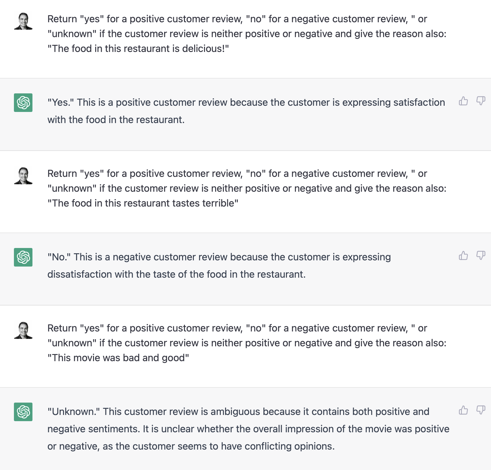

# Tristate Analyzer

## Description
A **Tristate Analyzer**, coined by [Andy Nanopoulos](https://www.andynanopoulos.com), is a system that analyzes an input and responds with one of three answers: **yes**, **no**, or **unknown**. Given that the results are bounded, one can use the results in a process or product workflow. For example, for the question "Is this customer review positive?", one could publish the positive reviews directly to social media, where negative reviews may need to be vetted. 

Large Language Models (LLM) can be used to analyze many types of inputs and return results that can be parsed as a **Tristate Analyzer**:


 This project uses the [**OpenAI**](https://platform.openai.com) APIs to provide the LLM analysis.


## Prerequisites

[**tristate-analyzer**](https://github.com/ananopoulos/tristate-analyzer) has been tested on a Mac using node version 16.15.0 and npm version 8.5.5

## Installation

You can clone this repo [**tristate-analyzer**](https://github.com/ananopoulos/tristate-analyzer) and modify it as needed or you can:
```
mpm install tristate-analyzer
```

## Usage
First, get an [**OpenAI**](https://platform.openai.com) key. Next, create a Node JS module to consume the analyzer. Here is a CLI you can use for testing:

```
const { analyze } = require("../lib/index.cjs");
const dotenv = require('dotenv');
dotenv.config();

const argv = require("yargs/yargs")(process.argv.slice(2))
  .option("data", {
    alias: "d",
    type: 'string',
    describe: "the data string to be analyzed"
  })
  .option("passFail", {
    alias: "p",
    type: 'boolean',
    default: false,
    describe: "use pass-fail criteria"
  })
  .demandOption(["data"])
  .help().argv;

const openApiKey = process.env.OPENAI_API_KEY;
const maxTokens = 100;

let tristateAnalyzerConfig = {
  yesCriteria: "positive customer review",
  noCriteria: "negative customer review",
  unknownCriteria: "the customer review is neither positive nor negative"
}

if (argv.passFail) {
  tristateAnalyzerConfig = {
    yesCriteria: "75% or more of the supplied statements are true",
    noCriteria: "74% or less of the supplied statements are false",
    unknownCriteria: "the supplied statements can not be analyzed"
  }
}

analyze(openApiKey, maxTokens, tristateAnalyzerConfig, argv.data).then((res) => {
  console.log(res);
});
```

Your **yesCriteria**, **noCriteria**, and **unknownCriteria** will be used to create this prompt within the package:

```
`Return \"yes\" if ${tristateAnalyzerConfig.yesCriteria}, \"no\" if ${tristateAnalyzerConfig.noCriteria}, or \"unknown\" if ${tristateAnalyzerConfig.unknownCriteria} and give the reason for your response: ${data}`
```
The package will send the prompt to the **gpt-3.5-turbo** model and return a response similar to this:

```
{
  analysis: 'yes',
  prompt: 'Return "yes" if positive customer review, "no" if negative customer review, or "unknown" if the customer review is neither positive nor negative and give the reason for your response: The food was very delicious and the staff was very polite',
  message: 'yes - The customer review is positive because they mentioned that the food was delicious and the staff was polite.'
}
```
You can use the **analysis** value to change your back-end workflow.

> Warning: Do NOT use this package in front-end code since your OpenAI key will be sent to the browser.

## License

[tristate-analyzer](https://github.com/ananopoulos/tristate-analyzer) is open source software [licensed as MIT](https://github.com/ananopoulos/create-yourstack-app/LICENSE).

## Contribute
Help us out! You can to this by

- Reporting a bug
- Discussing the current state of the code
- Submitting a fix
- Proposing new features

### How to Contribute
If you'd like to contribute to this project, follow this Github process:
[PR's via Forking a Project](https://docs.github.com/en/get-started/quickstart/contributing-to-projects
)

### Any contributions you make will be under the MIT Software License
When you submit code changes, your submissions are understood to be under the same [MIT License](http://choosealicense.com/licenses/mit/) that covers the project.

### Report bugs using Github's Issues
We use GitHub issues to track issues and tasks. Report an issue by [opening a new issue](https://github.com/ananopoulos/tristate-analyzer/issues)
